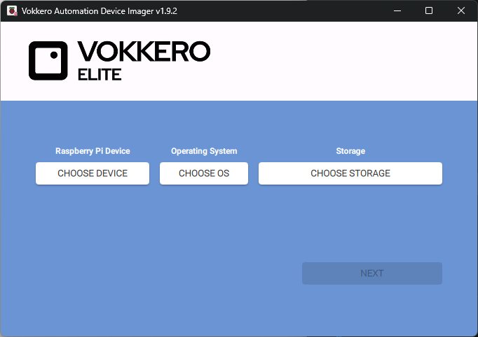

# vogo-EAD-raspberrypi-OS
A public repository of Raspberry-Pi OS "Imager" compatible images

## Adding this repository to the Raspberry Pi Imager Tool

* Open Raspberry Pi Imager.
* Go to Settings → Advanced Options → Custom OS List URL.
* In C:\Program Files (x86)\Raspberry Pi Imager, install a cmd file, that will provide the custom repo to the tool
* the custome repo can be provided with option --repo https://raw.githubusercontent.com/VogoVokkero/vogo-EAD-rapsberrypi-OS/refs/heads/main/os_list.json

see file [rpi-imager-vogo.cmd](rpi-imager-vogo.cmd)

* This shall provide VOGO images in Imager:

## Adding New Images (VOGO)

* newly built images are first archived using "zip custom-os.img"
* then the compressed archived is added as a release though the "Draft a new release" interface

